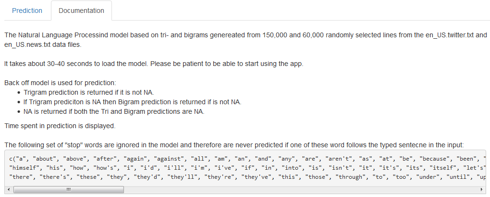

## My Shiny App: Word Predictor

It predicts the next word the user about to type in based on preceeding words and a statistical model that was trained on data sets from twitter and news blogs.
You can find my useful Shiny data product at: https://andraspap.shinyapps.io/NLP-Demo-Project/ 
The training data can be found at: https://d396qusza40orc.cloudfront.net/dsscapstone/dataset/Coursera-SwiftKey.zip

Give it a try!!

--- .class #id 

## Word candidates are shown in a word cloud

 

--- .class #id 

## Documentation tab helps users
 

--- .class #id 

## Thank You

Thank You for listening to me!

Check out my app: https://andraspap.shinyapps.io/NLP-Demo-Project/

Download it from: https://github.com/andraspap/NLP-Demo-App

